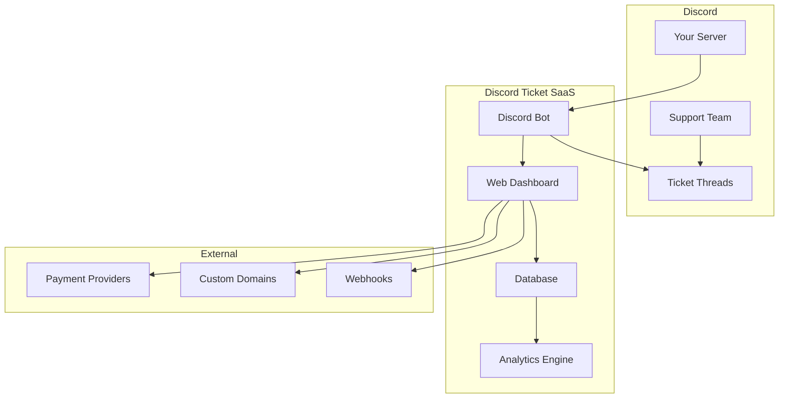

# Getting Started

Welcome to Discord Ticket SaaS! This guide will help you set up and configure your professional ticket management system in just a few minutes.

## Overview

Discord Ticket SaaS is a comprehensive solution for managing customer support tickets within Discord servers. It provides:

- **Thread-based tickets** with automatic numbering
- **Web dashboard** for configuration and analytics
- **Multi-guild support** with custom branding
- **Enterprise security** with industry-standard encryption
- **SaaS billing** with multiple subscription tiers

## Prerequisites

Before getting started, ensure you have:

- A Discord server where you have **Administrator** permissions
- A Discord application/bot (we'll help you create one)
- Basic understanding of Discord permissions and roles

## Quick Setup (5 minutes)

### Step 1: Add the Bot

1. **[Click here to add the bot](https://discord.com/api/oauth2/authorize?client_id=YOUR_CLIENT_ID&permissions=8&scope=bot)** to your Discord server
2. Select your server from the dropdown
3. Ensure all permissions are checked (required for full functionality)
4. Click **"Authorize"**

### Step 2: Access the Dashboard

1. Visit **[https://yourdomain.com/dashboard](https://yourdomain.com/dashboard)**
2. Click **"Login with Discord"**
3. Authorize the application to access your Discord account
4. You'll be redirected to your dashboard

### Step 3: Configure Your First Category

1. In the dashboard, select your server
2. Navigate to **"Ticket Categories"**
3. Click **"Create Category"**
4. Fill in the details:
   ```
   Name: General Support
   Description: Get help with general questions
   Channel: #support-tickets
   Emoji: 🎫
   ```
5. Click **"Save Category"**

### Step 4: Test Your Setup

1. Go to your Discord server
2. The bot will automatically create buttons in your configured channel
3. Click the **"🎫 General Support"** button
4. A new ticket thread will be created with the format `ticket-0001`

🎉 **Congratulations!** Your ticket system is now active.

## Architecture Overview

Understanding the system architecture helps with configuration and troubleshooting:



### Components

- **Discord Bot**: Handles all Discord interactions (buttons, modals, threads)
- **Web Dashboard**: Configuration interface and analytics
- **Database**: Stores tickets, users, configurations, and analytics
- **Payment System**: Manages subscriptions and billing
- **API**: Enables integrations and custom development

## Key Concepts

### Tickets

- **Thread-based**: Each ticket is a Discord thread
- **Automatic numbering**: `ticket-0001`, `ticket-0002`, etc.
- **Role-based access**: Control who can see and respond to tickets
- **Auto-close**: Configurable inactivity timer (default: 72 hours)

### Categories

- **Flexible routing**: Direct tickets to specific channels
- **Permission control**: Require or block specific roles
- **Custom branding**: Unique emojis and descriptions

### Guilds (Servers)

- **Multi-guild**: Manage multiple Discord servers
- **Per-guild config**: Each server has independent settings
- **Custom domains**: White-label solutions for enterprises

## Subscription Tiers

Choose the plan that fits your needs:

| Feature | Free | Pro | Enterprise |
|---------|------|-----|------------|
| Discord Servers | 1 | 5 | Unlimited |
| Monthly Tickets | 50 | 500 | Unlimited |
| Transcript Retention | 7 days | 30 days | 365 days |
| Custom Bot Token | ❌ | ✅ | ✅ |
| Custom Domain | ❌ | ❌ | ✅ |
| Priority Support | ❌ | ✅ | ✅ |

[Upgrade your plan →](/guide/subscription)

## Security & Privacy

We take security seriously:

- **Password Hashing**: Argon2id with configurable parameters
- **Token Encryption**: AES-256-GCM with unique IVs
- **JWT Signing**: EdDSA (Ed25519) for authentication
- **Data Encryption**: All sensitive data encrypted at rest
- **GDPR Compliance**: Data export and deletion tools

## Common Issues

### Bot Not Responding

1. Check bot permissions in Discord
2. Ensure the bot is online in the dashboard
3. Verify the bot token is configured correctly

### Tickets Not Creating

1. Check channel permissions for the bot
2. Ensure the category is properly configured
3. Verify the user has required roles (if configured)

### Dashboard Access Issues

1. Clear browser cache and cookies
2. Ensure you have Administrator permission in Discord
3. Try logging out and back in

## Next Steps

Now that you have the basics working:

1. **[Configure permissions](/guide/permissions)** - Set up role-based access
2. **[Customize categories](/guide/categories)** - Create specialized ticket types
3. **[Set up analytics](/guide/analytics)** - Track your team's performance
4. **[Configure auto-close](/guide/auto-close)** - Automate ticket management

## Need Help?

- 📚 **Documentation**: Browse our complete guides
- 💬 **[Discord Support](https://discord.gg/tb3KrFc2ED)**: Get help from our community
- 📧 **[Email Support](mailto:support@yourdomain.com)**: Direct access to our team
- 🐛 **[GitHub Issues](https://github.com/Legacy-DEV-Team/TicketSystem/issues)**: Report bugs or request features