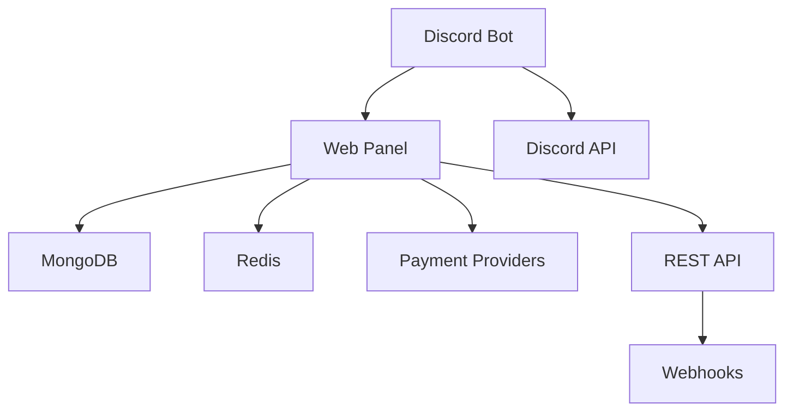

## Quick Start

Get your Discord ticket system running in minutes:

### For Server Owners

```bash
# 1. Add the bot to your Discord server
https://discord.com/api/oauth2/authorize?client_id=YOUR_CLIENT_ID&permissions=8&scope=bot

# 2. Access the web dashboard
https://ticketsystem.fyi/dashboard

# 3. Configure your first ticket category
# 4. Start supporting your community!
```

### For Developers

```bash
# Clone and install
git clone https://github.com/Legacy-DEV-Team/TicketSystem.git
cd TicketSystem
npm install

# Configure environment
cp .env.example .env
# Edit .env with your configuration

# Start development servers
npm run dev
```

## Architecture Overview

Ticket System is built with a modern, scalable architecture:



- **Discord Bot**: Multi-guild Discord.js bot with custom token support
- **Web Panel**: Next.js dashboard with admin configuration
- **Database**: MongoDB for data persistence, Redis for sessions
- **Security**: Argon2id + AES-256-GCM + EdDSA encryption
- **Payments**: Stripe, PayPal, and Patreon integration

## Key Features

### 🎯 **Ticket Management**
- Thread-based tickets with automatic numbering
- Configurable categories and permissions
- Auto-close system with customizable timers
- Rich HTML transcripts with full history

### 🏢 **Multi-Guild Support**
- Manage unlimited Discord servers
- Per-guild configuration and branding
- Custom bot tokens for white-label solutions
- Centralized analytics and reporting

### 🔐 **Enterprise Security**
- Industry-standard encryption (Argon2id, AES-256-GCM, EdDSA)
- Role-based access control
- Audit logs and activity tracking
- GDPR compliant data handling

### 💰 **SaaS Business Model**
- Multiple subscription tiers (Free, Pro, Enterprise)
- Automatic billing and subscription management
- Usage tracking and feature gating
- Revenue analytics and reporting

### 🔗 **Developer Friendly**
- Comprehensive REST API
- Real-time webhooks
- OpenAPI documentation
- TypeScript support throughout

## Community & Support

- 📚 **[Documentation](/guide/getting-started)** - Complete setup guides and API reference
- 💬 **[Discord Server](https://discord.gg/dayewa6xP6)** - Get help from our community
- 🐛 **[GitHub Issues](https://github.com/Legacy-DEV-Team/TicketSystem/issues)** - Report bugs and request features
- 📧 **[Email Support](mailto:support@ticketsystem.fyi)** - Enterprise support available

## License

This project is open source and available under the [MIT License](https://github.com/Legacy-DEV-Team/TicketSystem/blob/main/LICENSE).